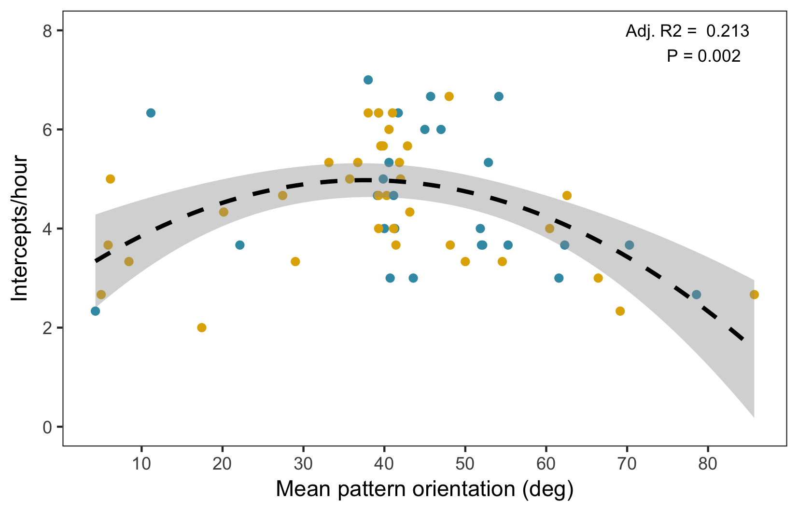

# All that glitters: jewelled spiders manipulate colour-lure geometry to deceive prey

Thomas E. White^1^

^1^Department of Biological Sciences, Macquarie University, Sydney, Australia, 2109

**Keywords:** Deception, communication, multicomponent signal, orb-web, Gasteracantha

**Word count:**

**No. figures:** 2

**No. tables:** 2

\newpage

# Abstract

Selection is expected to favour the evolution of efficacy in visual communication. This extends to deceptive systems, and predicts functional links between the structure of visual signals and their behavioural presentation. Work to date has primarily focused on colour, however, thereby understating the multicomponent nature of visual signals. Here I examined the relationship between signal structure, presentation behaviour, and efficacy in the context of colour-based prey luring. I used the polymorphic orb-web spider _Gasteracantha fornicata_, whose yellow- or white-and-black striped dorsal colors have been broadly implicated in prey attraction. In a manipulative assay, I found that spiders actively control the orientation of their conspicuous banded signals in the web, with a distinct preference for near-diagonal bearings. Further field-based study identified a predictive relationship between pattern orientation and prey interception rates, with a local maximum at the spiders' preferred orientation. There were no morph-specific effects on capture success, either singularly or via an interaction with pattern orientation. These results reveal a dynamic element in a traditionally 'static' signalling context, and imply differential functions for chromatic and geometric signal components across visual contexts. More broadly, they underscore how multicomponent signal designs and display behaviours may coevolve to enhance efficacy in visual deception.

\newpage

## 1. Introduction

Selection is expected to drive efficacy in visual communication. A predicted outcome is coevolution between signal components---including their behavioural presentation---to elicit a favourable response from receivers [@endler_signals_1992]. Though well explored in sexual [@white_signal_2015; @sicsu_here_2013] and antipredator [@kang_camouflage_2012; @kang_camouflage_2015] contexts, this prediction extends to deceptive signalling systems. In such cases, the most effective signals are those which exploit one or more perceptual biases to coerce a maladaptive response from potential prey [@searcy_evolution_2005]. Work to date, however, has largely focused on colour as a primary instrument of deception [e.g. @white_colour_2016; @tso_function_2006]. This understates the multicomponent nature of visual signals, which often encompasses both colour and geometry (e.g. pattern, shape, and orientation).

Colour-based luring has proven a valuable context for understanding visual deception. Orb-web spiders exemplify this predatory strategy, and many species use diverse body-architectures adorned with conspicuous colours and patterns to attract prey  [@white_technicolour_2015]. As sit-and-wait predators, orb-web spiders express a limited behavioural repertoire, though are capable of making active foraging decisions within the confines of their two-dimensional web [@zschokke_spider_2010; @uetz_prey_1987]. This offers a particularly tractable, albeit unexplored, context in which to explore the predicted links between deceptive signal structure, presentation, and efficacy.

The northern jewelled spider _Gasteracantha fornicata_ is an orb-weaver endemic to tropical and sub-tropical Australasia. Females of the species display either a conspicuous white-and-black or yellow-and-black banded colour pattern on an elongated dorsum (Fig. 1d; [@kemp_color_2013]), which has been broadly implicated in prey attraction [@hauber_conspicuous_2002; @white_colour_2016]. Here I used this species to examine the link between the structure of a putative multicomponent deceptive signal and its behavioural presentation. I approached this in two stages. First, I tested whether _G. fornicata_ actively control the orientation of their conspicuous colour patterns in the web. Second, I investigated the relationship between pattern orientation, colour, & fitness (via prey interception) in the wild.

## 2. Materials and methods

I conducted experiments with distinct natural populations of _G. fornicata_ in Cairns, Queensland, Australia, in March 2014 (part a) and February 2015 (part b, below). Female colour morphs are discrete, with either human-perceived 'yellow' or 'white' stripes adjacent to black bands (Fig. 1d), and can be reliably distinguished by eye [@kemp_color_2013].

***(a) Pattern orientation control***

To test whether _G. fornicata_ actively control the orientation of their patterns in the web, I first recorded the initial orientation of spiders (n = 43 white, 39 yellow spiders) _in situ_ using a modified 200 mm digital angle rule (Sinsui Co. Ltd., Tokyo, Japan). Here, and through both experiments, orientations are expressed with respect to the transverse, elongated axis of the spider's colour pattern, relative to the surface of the web (which are approximately vertical & symmetrical;  [@muma_biological_1971]). A measurement of 0^o^ thus indicates vertically-oriented stripes in the web, while 90^o^ indicates horizontally-oriented stripes. Furthermore, the set of all possible orientations is bounded between 0 and 90^o^ owing to the mirror- and functional-symmetry of spiders' signals in the web (Fig. 1d). For example, spiders oriented at 45^o^, 135^o^, 225^o^, and 270^o^ would all be displaying their striped signals at a functionally equivalent diagonal orientation (since a left-to-right diagonal orientation is equivalent to a right-to-left, assuming prey encounter spiders from random perspectives).

Following initial measurement, I manually removed each spider from the web and immediately replaced it at a randomly assigned orientation between 0 and 90^o^ (&plusmn; 3^o^, owing to behavioural variation), save for a random subset of control spiders that were replaced at their original orientation (n = 61 experimental, 21 control). Spiders that did not remain at the assigned orientation for 30 seconds were excluded from the experiment. I then recorded the subsequent orientation of each individual at 30-minute intervals for three hours (0900 - 1200 hours; _G. fornicata_'s peak activity period; @white_colour_2016).

***(b) Colour, pattern orientation, and prey interception***

To examine the relationship between colour, pattern geometry and rates of prey interception, I recorded the orientation of individual spiders of both morphs (as above) and prey interceptions at 30-minute intervals for three hours (0900 - 1200 hours; n = 36 'yellow', 27 'white' spiders total). I used the presence of new prey items and/or web damage as a measure of interceptions in the preceding time period [_sensu_ @opell_effects_2006; @gawryszewski_colouration_2012]. While this may overestimate true interception rates as a result of abiotic confounds (e.g. wind- or foliage-induced damage), these effects will be essentially random. Ultimately, our interception rate estimates (below) complemented previous work in this species informed by constant observation (see supplementary data in [@white_colour_2016]).

***(c) Statistical analyses***

I used multiple Pearsons' product-moment correlations to test whether, and to what extent, spiders recovered their initial signal orientation following manipulation. I calculated the strength of correlation between their initial and subsequent orientations at every 30-minute interval (including immediately post-manipulation), for control and experimental spiders. I used a Bonferroni-corrected threshold for statistical significance of &alpha; = 0.007.

I used a generalised linear model (GLM) to examine the relationship between interception rate (interceptions/hour) and mean colour pattern orientation. I included spider morph as a main effect, along with the linear and quadratic effects of orientation, and their interactions with spider morph, following the visual inspection of data. The assumptions of statistical tests were validated prior to analysis, and all analyses were conducted in R [ver. 3.3; @R_program].

## 3. Results

***(a) Pattern orientation control***

The banded colour-patterns of spiders were non-randomly oriented in the web at the onset of the experiment (mean &plusmn; se = 46 &plusmn; 2^o^; Fig. 1a, d). Following randomisation (Fig. 1b, e), experimental spiders measurably recovered their initial orientations after 120 minutes (Pearson's _r_ = 0.380, 95% CI = 0.142-0.577, _P_ = 0.003). The correlation between spiders' pattern orientations pre- and post-manipulation strengthened until observations ceased after 180 minutes (Table 1; Fig. 1c, f). Control spiders largely maintained the initial orientation of their patterns throughout the observational period  (Table 1).

|     |Time (min.)| 0 |   30   |   60   |   90   |    120    |    150    |    180    |
|:---:|:---:|:-------:|:------:|:------:|:------:|:---------:|:---------:|:---------:|
|**Exp.**| r  | -0.099  |  0.021 | -0.011 |  0.194 | 0.380 | 0.416 | 0.636 |
|     |low. CI| -0.342 | -0.232 | -0.262 | -0.060 | 0.142 | 0.183 | 0.458 |
|     | up. CI| 0.157 |  0.271 |  0.241 |  0.426 | 0.577 | 0.604 | 0.766 |
|     |  P    |0.448|  0.873 | 0.932  |  0.133 | **0.003** |**< 0.001**|**< 0.001**|
|**Con.**|  r | 0.985|  0.586  |  0.770  |  0.625  |   0.695   |   0.767   |   0.800   |
|     |low. CI| 0.963| 0.207   |  0.507  |  0.264  |   0.376   |    0.483  |    0.562  |
|     | up. CI| 0.994|  0.812  |  0.902  |  0.832  |   0.867   |    0.896  |    0.915  |
|    | P |**< 0.001**|**0.005**|**0.002**|**0.002**|**< 0.001**|**< 0.001**|**< 0.001**|

Table: Pearson's product-moment correlations (&plusmn; 95 % CI) between initial colour-pattern orientations, and those immediately following manipulation (time 0) and at subsequent 30-minute intervals, for experimental and control groups. Bolded P values indicate Bonferroni-corrected significance.   

![The orientation of spiders' colour patterns (a) prior to manipulation, (b) immediately following randomisation, and (c) at the conclusion of the experiment. (d) An illustration of the mean initial orientation of _G. fornciata_. The correlation (pooled across treatments) between initial orientation and measured orientations (e) immediately following randomisation and (f) at the conclusion of the experiment. Yellow and black points denote 'yellow' and 'white' spider morphs, respectively. Note that possible orientations are bounded between 0 and 90, owing to the multiple functional axes of symmetry (see main text).](../figs/fig_1.png)

***(b) Colour, pattern orientation, and prey interception***

There was a relatively strong relationship between colour pattern orientation and prey interception rate (F~5,57~ = 4.365, P = 0.002, Adj. R^2^ = 0.213). There were significant linear and quadratic effects of pattern orientation, with interception rates maximised around the mean of 42 &plusmn; 3^o^ (&plusmn; se; Fig. 2). Colour morph had no discernable effect on interception rates either singly or via an interaction with pattern orientation (Table 2).  

|                    |  Estimate |   SE    |      t     |      P    |
|:------------------:|:---------:|:-------:|:----------:|:---------:|
|    Intercept       | **3.185** |**1.050**|  **3.034** | **0.003** |      
|     Morph          |  -0.407   |  1.260  |   -0.322   |   0.748   |
|    Orient.         | **0.106** |**0.048**|  **2.221** | **0.030** |
| Orient.^2^         |**-0.001** |**0.001**| **-2.674** | **0.009** |
| Morph x Orient.    |   0.005   |  0.058  |    0.950   |   0.925   |
| Morph x Orient.^2^ |   0.001   |  0.001  |    0.054   |   0.957   |

Table: GLM results testing the relationship between between colour, pattern orientation, and prey interception. Variables: _Morph_ spider colour morph; _Orient._ and _Orient.^2^_, linear and quadratic effects of banded colour pattern orientation. Bolded estimates indicate significance at &alpha; = 0.05.   

# 4. Discussion

Signalling theory contends that communication systems should evolve to enable the effective generation and transmission of signals [@endler_signals_1992; @searcy_evolution_2005]. However, the predicted functional links between colour-signal components and signalling behaviours in the context of deception are poorly supported. Across experimental and observational assays, I found that _G. fornciata_ control the orientation of their banded colour signals in the web (Fig. 1), and that pattern orientation is predictive of prey interception rates (Fig. 2). These results reveal an element of dynamism in an otherwise 'static' sit-and-wait signalling system through the active manipulation of colour-lure geometry. More broadly, they are consistent with a coevolutionary link between multicomponent signal design and signalling behaviour in the context of colour-based luring.

The nature of the biases being exploited in prey through the use of a near-diagonal stripe remain to be identified (Fig. 1), though two non-exclusive visual and/or perceptual effects would likely be induced. One is form disruption. Highly contrasting stripes are known to confuse edge-detection mechanisms across taxa (i.e. 'disruptive coloration', [@stevens_defining_2009]), which may inhibit the recognition of _G. fornicata_ as a potential threat by their primarily dipteran and hymenopteran prey [@hauber_conspicuous_2002; @white_colour_2016]. This does not account for the specific orientational preference of spiders, however, since the disruptive effects would likely arise irrespective of signal geometry.

A second possibility is that the banding pattern and orientation of spiders effectively stimulates the motion-detection pathways of potential prey. Small free-flying insects, such as flies, typically move in a series of rapid, translational saccades in the horizontal and/or vertical plane [@srinivasan_motion_1999; @dickinson_initiation_2005]. From the perspective of such a viewer, a horizontally-oriented (90^o^) stripe would almost exclusively generate vertical motion on the retina, while a vertical striping would generate horizontal motion. By orienting off-axis, spiders may benefit from the induction of motion cues (i.e. self-induced 'flicker') in both dimensions, on average. This may, among other effects, more reliably attract the attention of passing prey [@srinivasan_motion_1999]. Evidence for the use of banded patterns for the active attraction of receivers in such a manner, rather than camouflage and/or crypsis, is sparse, and would repay further study.

The absence of morph-specific effects on prey interception rates (Table 1) suggests a degree of functional, and evolutionary, independence between chromatic and geometric signal components. This is not unexpected, given that the contributions of colour and pattern elements to the subjective appearance of signals will shift with viewing context, and particularly distance. The size and spatial frequency of _G. fornicata_'s stripes (Fig. 1d) means that a distinct banding pattern will only be resolvable upon relatively close inspection by insect prey [@wehner_spatial_1981]. At longer range the dark and light bands will appear to blend, at which point the more general signal features of colour and luminance will predominate. Recent work in this species suggests that the chromatic and achromatic contrasts generated by 'yellow' and 'white' colour morphs, respectively, enhance their conspicuousness within different visual channels in prey, and that this may contribute to the maintenance of polymorphism [@white_colour_2016]. This, together with the results of the present study, implies that the colour and pattern of _G. fornicata_'s signals may have been differentially selected for their deceptive effects across viewing contexts. The overall 'colour' of lures may target general chromatic and/or achromatic preferences in prey (sensu [@white_colour_2016]), while the banded pattern may exploit attentional or edge-detection mechanisms when encountered at close range (as noted above). These hypotheses stands to be tested, and the complex interaction between signal structure, signalling behaviour, and receiver visual ecology in this system [@white_colour_2016; @kemp_color_2013; @white_perceptual_2016] presents exciting opportunities for further illuminating the evolution of efficacy in deception.

**Acknowledgements**  

I am grateful to Darrell Kemp for valuable discussions and assistance, and Elizabeth Mulvenna for all her support.

**Data accessibility**

All raw data and code are available via github (https://github.com/thomased/ms_spiderpattern), and will be made persistently available upon acceptance.

**Funding statement**

TEW was supported by and Australian Postgraduate Award.

\newpage

# References
